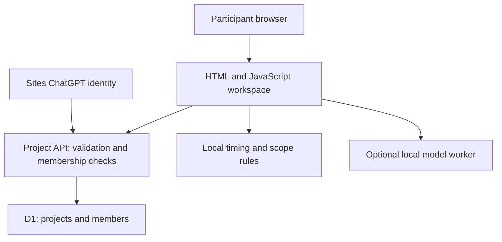

# Hackathon Mission Control

A workspace that helps first-time participants and hackathon teams turn an idea into a complete submission. It combines preparation, task ownership, deadlines, scope recovery and pitch preparation.

[Live application](https://hackathon-mission-control-shiva.shivasaichavala777.chatgpt.site) · [Guided demo — no sign-in](https://hackathon-mission-control-shiva.shivasaichavala777.chatgpt.site/?demo=guided)

**Stage:** public pilot. Practical value has not yet been measured with real teams. Browser visual QA, end-to-end hosted sign-in and local model inference are not verified.

## Why this exists

A team can build a promising prototype and still struggle to present it or meet submission requirements. Beginners may also arrive without knowing how to contribute. Mission Control makes the next task and required deliverables visible from the beginning.

Read the [ideation brief](docs/ideation.md), [PRD](docs/prd.md), [architecture](docs/architecture.md) and [roadmap](docs/roadmap.md).

## What works today

- Five-step guided demo with Team Vishnu, available without an account.
- Beginner onboarding and a preparation checklist.
- ChatGPT sign-in for saved projects; project membership through random join codes.
- Hosted project storage: brief, event timings, rules, tasks and submission requirements.
- Tasks with owners, due times, statuses and observable completion criteria.
- Explicit saving, conflict protection and shared progress checks every ten seconds.
- Rule-based Scope Rescue and Time Coach.
- Pitch outline, rehearsal timer, brief downloads and editable LinkedIn drafts.
- Site QR code and a copyable public link.

**Simulations:** Google sign-in buttons, platform connections, member invitations in the integration practice panel, and social publishing. These do not connect external accounts or publish posts. Real project access uses ChatGPT sign-in and project join codes.

**Experimental:** an optional browser worker uses FLAN-T5 Small to shorten text. It downloads model/runtime files and requires a compatible browser and network. A structured pitch remains available without AI.

## Tech stack

| Responsibility | Implementation |
|---|---|
| Interface | HTML, CSS and vanilla JavaScript |
| Request handling | TypeScript route handlers using Vinext/Vite and the retained Sites starter |
| Hosted runtime | Cloudflare Workers through Sites |
| Durable data | Cloudflare D1, with Drizzle-generated SQL migrations |
| Validation | Zod |
| Identity | Dispatch-owned ChatGPT sign-in and trusted identity headers |
| Guidance | Deterministic rules using task state and time remaining |
| Optional AI | Transformers.js 3.8.1, ONNX Runtime, Xenova/flan-t5-small |
| Tests | Node.js assertions, Miniflare D1 and jsdom |
| Packages | pnpm 11.25.0 with a committed lockfile |

The starter contains React and UI libraries; the current interface is HTML/JavaScript served by `app/route.ts`, rather than a React component dashboard.

## Architecture



## Run locally

Use Node.js 24 and pnpm 11.25.0. The minimum declared Node version is 22.13.0.

```sh
npm install --global pnpm@11.25.0
pnpm install --frozen-lockfile
pnpm build
node --import ./scripts/sites-env.mjs ./node_modules/wrangler/bin/wrangler.js d1 execute DB --local --config dist/server/wrangler.json --persist-to .wrangler/state --file drizzle/0000_lying_dreadnoughts.sql
pnpm dev
```

The portable development profile normally serves on port 5173. Visit the printed localhost address. Use `/signin-with-chatgpt?return_to=/` for the starter's local mock identity. Local and hosted databases are separate. Apply each migration once; do not replay an already-applied local migration.

No model API key is required. D1 is the logical `DB` binding in `.openai/hosting.json`. The export intentionally omits the live Site's project ID, credentials, visitor data and local database files.

Do not expose this local development setup publicly. The production authentication boundary is Sites dispatch; deploying elsewhere requires trusted identity verification rather than accepting client-supplied identity headers.

## Checks

```sh
pnpm check:syntax
pnpm test
pnpm build
```

Tests cover authorization, joining, saved updates, optimistic conflicts, invalid timings, invite rotation, page initialization, project setup and the guided journey. jsdom checks interaction logic; it does not prove visual layout or full browser compatibility.

For a schema change, edit `db/schema.ts`, run `pnpm db:generate`, inspect the SQL, apply it locally and publish through Sites. Keep applied migrations immutable.

## Project layout

- `app/mission.html`: application markup, styles and original prototype logic.
- `public/shared.js`: saved-project interface and synchronization.
- `public/guided-demo.js`: isolated demonstration journey.
- `public/ai-worker.js`: optional local model inference.
- `app/api/projects/route.ts`: project API and server-side authorization.
- `app/chatgpt-auth.ts`: Sites identity helper.
- `db/`, `drizzle/`: database schema, helpers and migration history.
- `tests/`: API/D1 and DOM interaction tests.
- `build/`, `scripts/`: retained runtime and build helpers.
- `docs/`: product, architecture, demo and validation documentation.

## API

`GET /api/projects` lists the signed-in user's projects. `GET /api/projects?id=<uuid>` reads a project only for members.

`POST /api/projects` accepts `create`, `join`, `save` and `invite`. Saving requires the current revision; a stale revision returns HTTP 409. Only a project's owner can rotate its join code. Requests are validated server-side.

## Security and limitations

See [SECURITY.md](SECURITY.md) and [testing notes](docs/testing.md). Public access does not grant website editing or access to arbitrary saved projects. Project members can edit that project's data. Saving is explicit; updates are polled rather than streamed.

Missing production capabilities include member removal, project deletion, automated retention, backup/restore procedures, dedicated abuse throttling, operational monitoring and a measured real-team pilot. Pitch and social drafts are session-local; preparation checkmarks are device-local.

## Contributing and licence

See [CONTRIBUTING.md](CONTRIBUTING.md). This project uses the [MIT licence](LICENSE), selected by the repository owner. Retained third-party notices and component licences continue to apply; see [THIRD_PARTY_NOTICES.md](THIRD_PARTY_NOTICES.md).

Created by Shivasai Chavala. GitHub source publication does not automatically deploy changes to the live Site.
